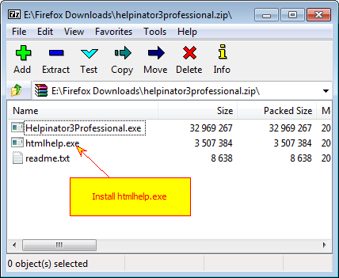
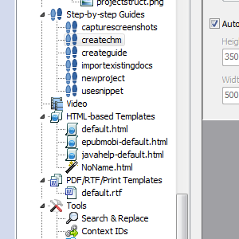
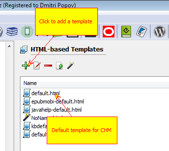
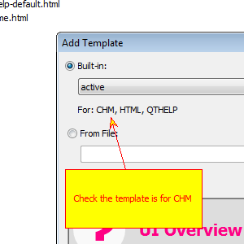
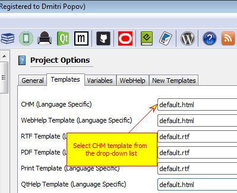
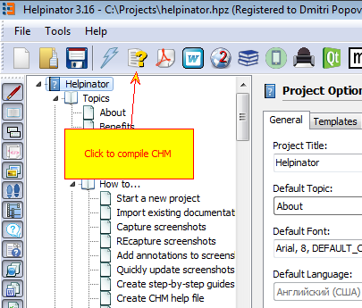

## Create CHM help file

**1\. Install HTMLHELP.EXE**

First of all you need HTMLHELP.EXE &#40;a tool from Microsoft that allows you to compile CHM help files&#41;. For your convinience it is packed in the same zip archive with Helpinator.

**2\. Check &#34;HTML-based templates&#34;**

Check &#34;HTML-based templates&#34; node of the project tree view. It has default.html template for CHM output but you can check for more built-in templates.

**3\. Click &#34;+&#34; to add more CHM templates**

Click on green plus sign and &#34;Add template&#34; dialog opens.

**4\. Select a template from the drop-down list**

Select a template from the drop-down list. A preview od compiled topic appears at the bottom. Note that there is &#34;For: CHM&#34; text below template title.

**5\. Select added template from the drop-down list**

Now you need to activate your template. Select root node in the project tree view, browse to &#34;Templates&#34; tab and select template from the &#34;CHM&#34; drop-down.

**6\. Click &#34;Compile CHM&#34; on the main tool bar.**

Now you can click &#34;Compile CHM&#34; on the main tool bar and Helpinator will compile a CHM help file for you.

