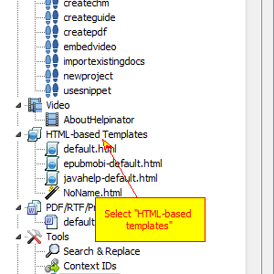
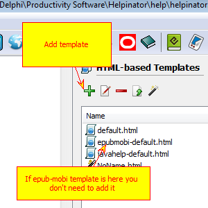
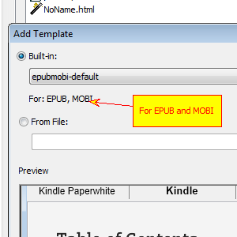
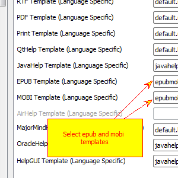
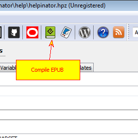
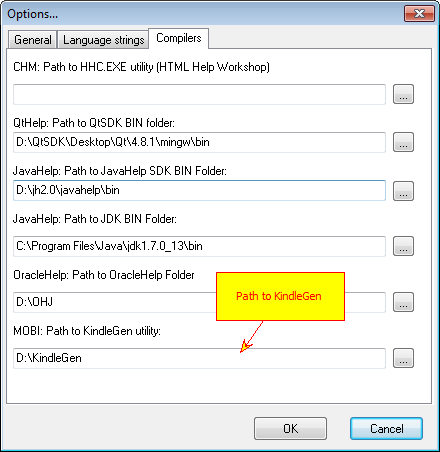
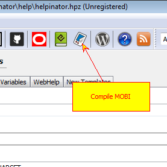

## Create EPUB and MOBI ebooks

**1\. Select &#34;HTML-based templates&#34;**

Select &#34;HTML-based templates&#34; node in the project tree view and check for &#34;epubmobi-default.html&#34; template. If it is in place, proceed to step 5.

**2\. Click &#34;Add template&#34;**

Click &#34;+&#34; to add epub-mobi template. IF you can see it in the list, you don't need to add it.

**3\. Select epub-mobi template**

Select &#34;epub-mobi&#34; template from the list and click &#34;OK&#34;

**4\. Set epub-mobi template**

Select root node in the project tree view and browse to &#34;Templates&#34; tab, then select &#34;epub-mobi&#34; template from drop-down lists for EPUB and MOBI formats.

**5\. Compile EPUB**

Now you can click &#34;Compile EPUB&#34; to create epub file. To compile MOBI you need to take some more steps.

**6\. Download KindleGen**

To compile MOBI you need to download and install KindleGen - free command-line tool from Amazon that allows to create MOBI ebooks.

**7\. Set path to KindleGen**

Select Main Menu -> Tools -> Options and enter path to KindleGen utility.

**8\. Compile MOBI**

Now you can click &#34;Compile MOBI&#34; to create mobi file.

