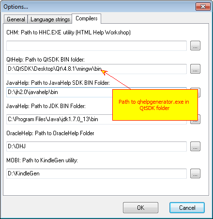
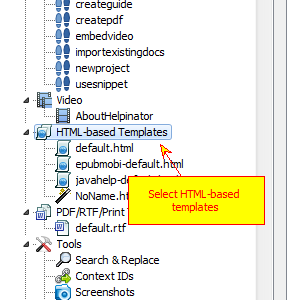
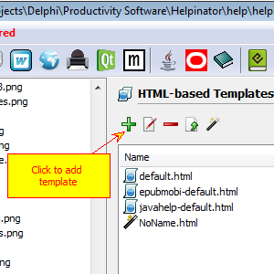
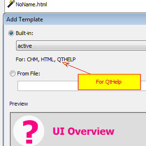
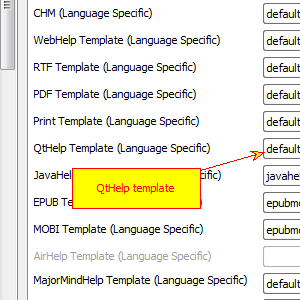
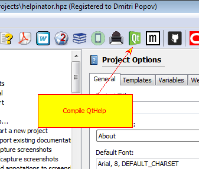

## Create QtHelp

**1\. Download and install Qt SDK**

Download and install QtHelp SDK if you haven't already done so.

**2\. Set path to qthelpgenerator.exe**

Select Main Menu->Tools->Options and enter &#34;Path to QtSDK BIN folder&#34; where qthelpgenerator.exe is located.

**3\. Select &#34;HTML-based templates&#34;**

Select &#34;HTML-based templates&#34; and check there's a template for QtHelp. Helpinator's default.html is QtHelp-compatible.

**4\. Click &#34;Add template&#34;**

Click &#34;Add template&#34; if you are not satisfied with default template.

**5\. Check for QtHelp templates**

Select templates that have &#34;For: QTHELP&#34; label.

**6\. Set QtHelp template**

Select root node in the project tree view and browse to &#34;Templates&#34; tab, then select template for QtHelp from the drop-down list or leave default.html.

**7\. Compile QtHelp**

Now you can click &#34;Compile QtHelp&#34; on the main tool bar to compile QtHelp help file.

