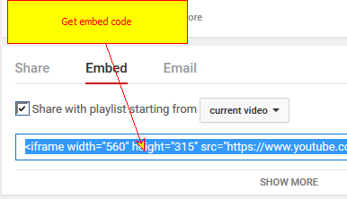
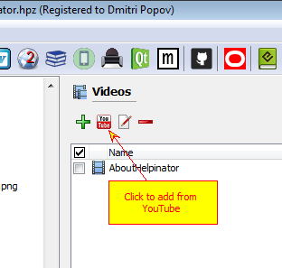
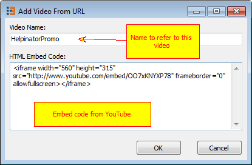
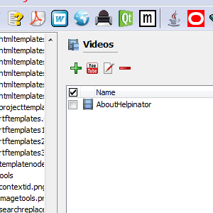
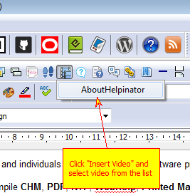

## Embed Video from YouTube, Vimeo and etc

**1\. Get HTML Embed Code from service provider**

First of all you need to get your video embed code from video service provider &#40;YouTube in this case&#41;.

**2\. Select &#34;Video&#34; node**

Select &#34;Video&#34; node in the project tree view.

**3\. Click &#34;Add video from YouTube&#34;**

Click &#34;Add video from YouTube, Vimeo...&#34;

**4\. Enter name and embed code**

Enter name to refer to this video and embed code from service provider.

**5\. Video appears in the video library**

Now your video is in project's video library and you can embed it into topics.

**6\. Click &#34;Insert Video&#34;**

Select a topic to insert video into, place cursor where you want your video to appear and click &#34;Insert Video&#34; on the editor tool bar.

**7\. Placeholder appears**

Video placeholder appears in the position of cursor. Now Helpinator will insert your YouTube video into compiled documentation if the selected output format supports video. 

