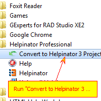
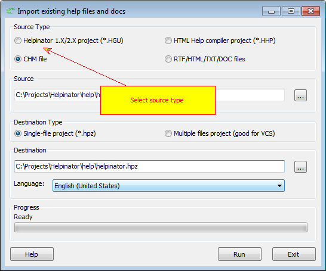
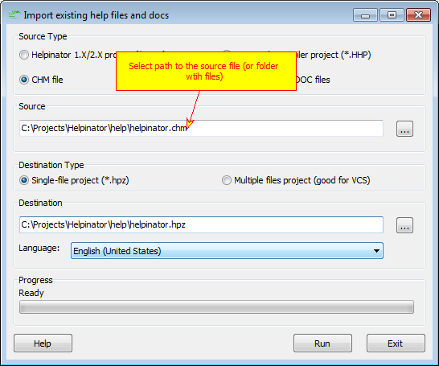
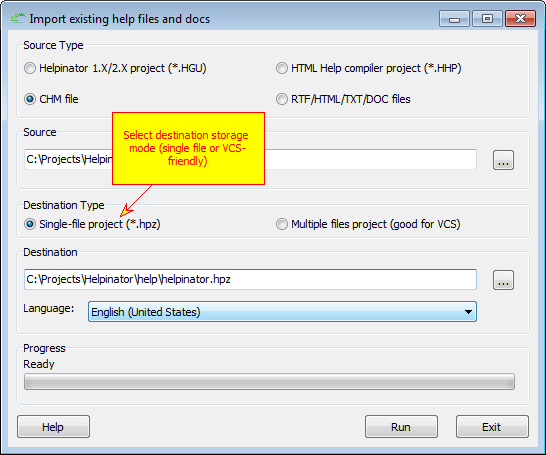
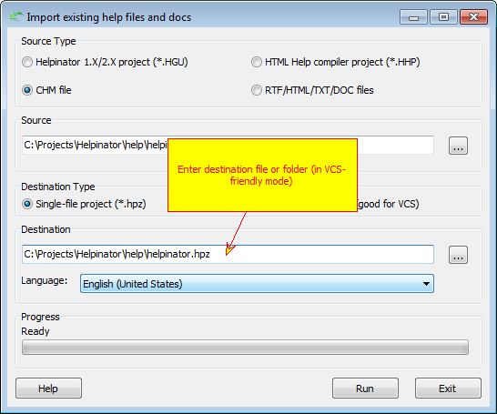
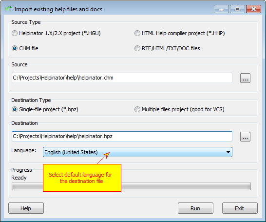
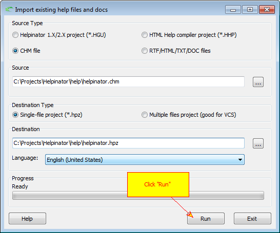

## Import existing documentation

**1\. Run &#34;Convert to Helpinator 3 Project&#34;**

**2\. Select source type**

First of all, select what you want to import.

**3\. Select source files**

Select source files &#40;in case of old Helpinator project or CHM&#41; OR source folder &#40;in case of HHP and DOC/TXT/HTML files import&#41;.

**4\. Select destination project storage mode**

Select destination project storage mode. Single file mode is more compact while &#34;Multiple files&#34; mode is good for version control systems - you can check in only those files that were altered, not entire project.

**5\. Enter destination path**

Select path to save new project with imported data to.

**6\. Select default project language**

Select default destination project file. You can add more languages later.

**7\. Click &#34;Run&#34;**

Clcick &#34;Run&#34; and wait for the process to finish. Now you can open destination file in Helpinator.

Note that import creates topics tree according to the order of file names, you'll have to set the proper order of topics by yourself. Read  [this topic](howtochangeorderandhierarchyoftopicsquickly "this topic")  to know how to do it quickly.
