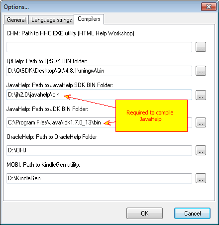
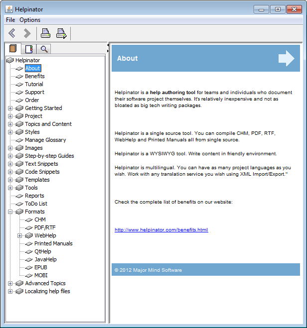
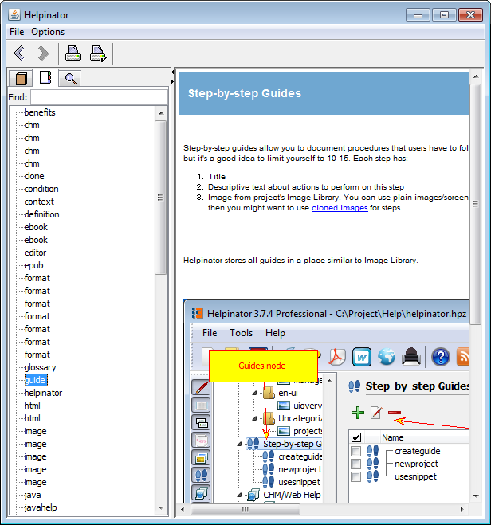
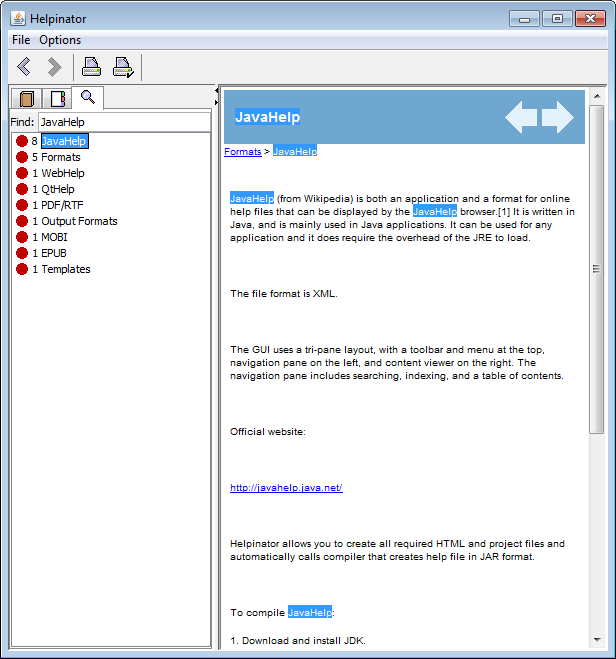

## JavaHelp

JavaHelp (from Wikipedia) is both an application and a format for online help files that can be displayed by the JavaHelp browser.[1] It is written in Java, and is mainly used in Java applications. It can be used for any application and it does require the overhead of the JRE to load.

The file format is XML.

The GUI uses a tri-pane layout, with a toolbar and menu at the top, navigation pane on the left, and content viewer on the right. The navigation pane includes searching, indexing, and a table of contents.

Official website:

[http://javahelp.java.net/](http://javahelp.java.net/ "http://javahelp.java.net/")

Helpinator allows you to create all required HTML and project files and automatically calls compiler that creates help file in JAR format.

To compile JavaHelp:

1. Download and install JDK.

2. Download and install JavaHelp SDK

[http://download.java.net/javadesktop/javahelp/javahelp2_0_05.zip](http://download.java.net/javadesktop/javahelp/javahelp2_0_05.zip "http://download.java.net/javadesktop/javahelp/javahelp2_0_05.zip")

3. Run Helpinator, select Main Menu->Tools->Options and enter both paths to JDK and JavaHelp "bin" folders.

Note that JavaHelp uses obsolete HTML viewer not capable of handling modern HTML features therefore it requires separate HTML template, default templates for CHM/WebHelp/QtHelp are not compatible with this output format.

Compiled JavaHelp file looks like this:

