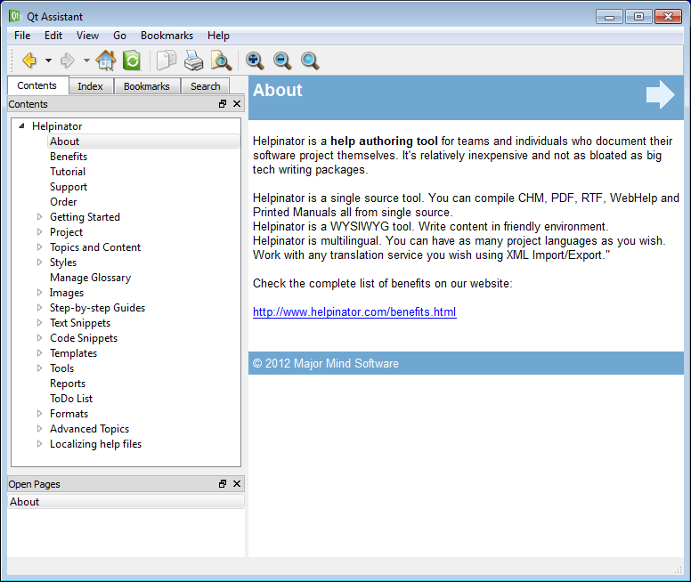
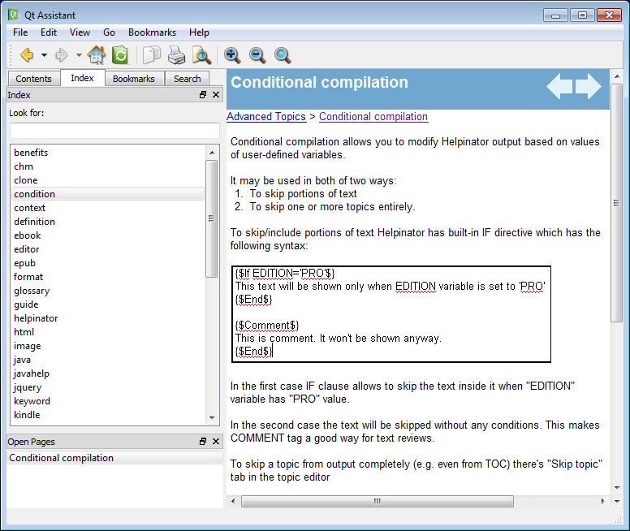
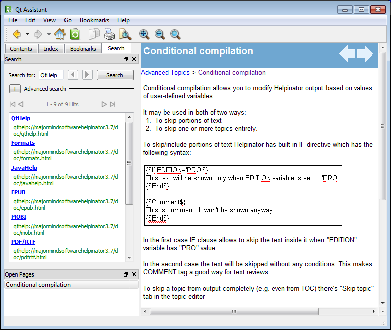

## QtHelp

**Qt ** (from Wikipedia) -  is a cross-platform application framework that is widely used for developing application software with a graphical user interface (GUI) (in which cases Qt is classified as a widget toolkit), and also used for developing non-GUI programs such as command-line tools and consoles for servers.

You can read entire article here:

[http://en.wikipedia.org/wiki/Qt_framework](http://en.wikipedia.org/wiki/Qt_%28framework%29 "http://en.wikipedia.org/wiki/Qt_framework")

Qt framework has it's own help file format and framework called QtHelp aimed to provide native help files for applications written with Qt. You can read detailed description here:

[http://doc.qt.digia.com/qt/qthelp-framework.html](http://doc.qt.digia.com/qt/qthelp-framework.html "http://doc.qt.digia.com/qt/qthelp-framework.html")

Helpinator allows you to create QtHelp files with one mouse click. However you will need QtSDK to do it. Helpinator will create HTML files and all required QtHelp project files, then it will call help file compiler to create target help files.

To compile QtHelp you have to:

1. Download and install QtSDK.
2. Run Helpinator and select Main Menu->Tools->Options, then select "Compilers tab"
3. Find QtSDK path line and enter path to BIN folder of QtSDK.

Note that to use Step-by-step Guides in your help files you will need QtSDK 4.8 and higher.

Resulting documentation looks like this:

****

****

