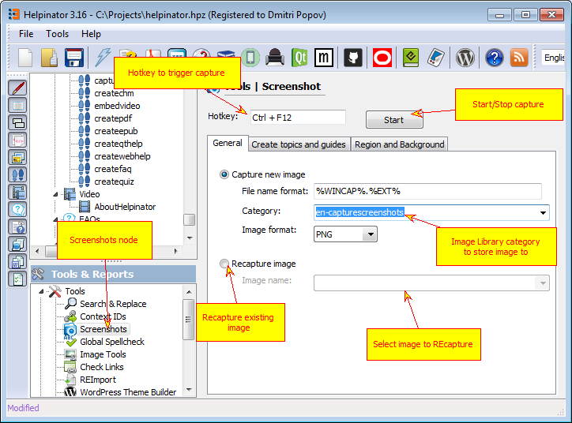
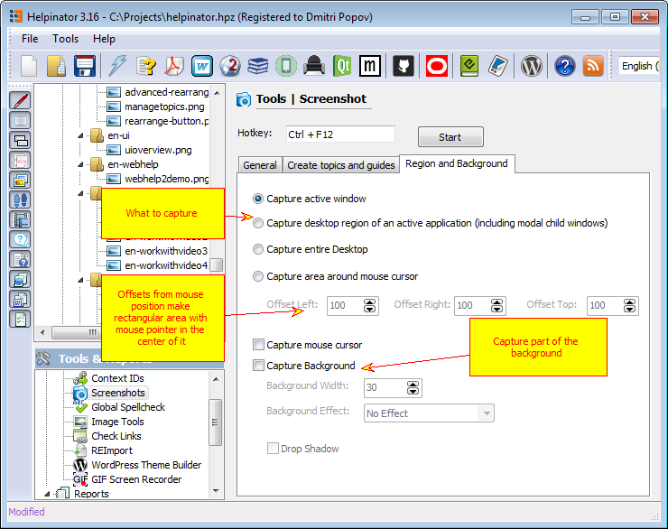

## Screenshots

"Screenshots" tool allows you to capture screenshots, store them to the project's image library, create new topics and guides with captured images and more.

At the top of the window there are hotkey selector and start/stop button to start capture process.

Below is the settings tab set.

"General" tab allows you to select whether you want to capture new image and put it into specific category or recapture existing image.

"Create topics and guides" tab allows you to create content elements when a new screenshot is captured.

You can:

1. Create new topic containing captured image
2. Append captured image to existing topic
3. Create a new step-by-step guide. The new guide will be created on the first capture after you click "Start". All captures after that will be appended to this guide.
4. Append to Guide - newly captured images will be added as new steps to existing guide.

"Region and background" tab allows you to select what you want to capture.

You can:

1. Capture active window only
2. Capture entire desktop area
3. Capture rectangular area around mouse cursor. In this mode you have to specify offsets in pixels from current mouse position that define rectangular area.
4. Capture mouse cursor - allows to put current mouse cursor on the screenshot.
5. Capture background - allows to capture rectangular area surrounding current capture rectangle. You can specify what part of the background to capture, effects to apply to it (you might want to darken or blur it) and make capture rectangle to "drop shadow" on background.

