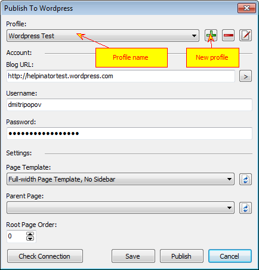

Wordpress is the most popular CMS in the world. If your website is based on Wordpress and you need to organize online help for your product - you don't need to create separate WebHelp section on your website aside from Wordpress. With Helpinator you can publish directly to Wordpress and turn topics into pages (not posts!). So you can use all Wordpress features in your online help!

Example Wordpress site with Helpinator's own documentation:

[http://helpinatortest.wordpress.com](http://helpinatortest.wordpress.com "http://helpinatortest.wordpress.com")

To publish your help file to Wordpress you need to set up your account information and select publishing options.

Helpinator operates "profiles" to manage Wordpress sites. You can have several profiles and publish documentation to several blogs (test site and the main product site, for example). Click "+" to add new profile and select profile name.

Then you need to enter account info:

- Blog URL (like http://www.mysite.com/blog or http://blog.mysite.com)

- Username and password

Note that Helpinator does not store your password anywhere for security reasons. If you close Helpinator your password is lost.

Publishing settings:

1. Page template - select one of PAGE templates available in your Wordpress theme. Click "Refresh" button next to it to get a list of templates.

2. Parent Page - a page to assign root page of documentation to. Leave it blank to publish to the main menu. Click "Refresh" button next to it to get a list of pages.

3. Root page order. By default your documentation root page will be attached to the end of parent page child pages list. You can change this value to insert it into another place.

Click "Check connection" to check URL, username and password.

Click "Save" to save your account info (without publishing) or "Publish" to publish it right away.

Don't forget to save your project after you publish your documentation, otherwise you will NOT be able to republish it (e.g. overwrite altered topics).
